# 🛡️ GeoGuard Privacy

<div align="center">


**Intelligent Location Privacy Protection for the Modern Web**

[](https://github.com/yourusername/geoguard)
[](LICENSE)
[](https://chrome.google.com/webstore)
[](https://python.org)

*Context-aware location privacy that adapts to your needs while maintaining functionality*

[🚀 **Quick Start**](#quick-start) • [📖 **Documentation**](#documentation) • [🧪 **Testing**](#testing) • [🤝 **Contributing**](#contributing)

</div>

---

## ✨ What Makes GeoGuard Special?

GeoGuard isn't just another location blocker—it's an intelligent privacy system that **learns your patterns** and **adapts protection levels** based on context. While traditional blockers break location-based services, GeoGuard provides **privacy-preserving coordinates** that keep websites functional while protecting your real location.

### 🎯 Key Features

<table>
<tr>
<td width="50%">

**🧠 Smart Protection**
- Machine learning-based sensitive location detection
- Automatic privacy level adjustment for home/work
- Context-aware coordinate obfuscation

</td>
<td width="50%">

**⚙️ Flexible Controls** 
- Per-website privacy settings
- Adjustable protection levels (1-10)
- Real-time privacy status monitoring

</td>
</tr>
<tr>
<td width="50%">

**🔬 Advanced Analytics**
- Location clustering and POI detection
- Privacy effectiveness metrics
- Comprehensive testing suite

</td>
<td width="50%">

**🛠️ Developer Friendly**
- RESTful API backend
- Extensive logging and debugging
- Modular architecture

</td>
</tr>
</table>

---

## 🏗️ Architecture Overview

```mermaid
graph TB
    A[🌐 Website] -->|Location Request| B[📱 Browser Extension]
    B -->|Original Coordinates| C[🐍 Python Backend]
    C -->|ML Analysis| D[🧠 Privacy Engine]
    D -->|Protected Coordinates| C
    C -->|Response| B
    B -->|Privacy-Preserving Location| A
    
    E[📊 Location History] --> C
    F[🏠 POI Detection] --> D
    G[⚙️ User Settings] --> D
    
    style A fill:#e1f5fe
    style B fill:#f3e5f5
    style C fill:#e8f5e9
    style D fill:#fff3e0
```



---

## 🚀 Quick Start

### Prerequisites

- **Python 3.8+** with pip
- **Chrome/Chromium Browser**
- **Location services enabled**

### 1️⃣ Backend Setup

```bash
# Clone the repository
git clone https://github.com/yourusername/geoguard.git
cd geoguard

# Install Python dependencies
pip install flask flask-cors numpy scikit-learn

# Start the backend server
cd backend
python main.py
```

The backend will start on `http://127.0.0.1:5000` 🚀

### 2️⃣ Extension Installation

1. **Open Chrome** and navigate to `chrome://extensions/`
2. **Enable Developer Mode** (toggle in top-right)
3. **Load Unpacked** → Select the `geogaurd_extension` folder
4. **Pin the extension** for easy access

### 3️⃣ Verification

```bash
# Test the backend connection
curl http://127.0.0.1:5000/status

# Expected response:
{
  "status": "online",
  "version": "1.0.0",
  "pois": 0,
  "clusters": 0,
  "locations": 0
}
```

---

## 🎮 Usage Guide

### Basic Usage

1. **🔧 Configure Privacy Level**
   - Click the GeoGuard extension icon
   - Adjust the privacy slider (1-10)
   - Enable/disable for specific websites

2. **🌍 Visit Location-Enabled Sites**
   - Maps, weather, delivery services
   - GeoGuard automatically protects your location
   - View real-time protection status in popup

3. **📊 Monitor Protection**
   - Check the **Statistics** tab for effectiveness metrics
   - View **protected vs. original** coordinates
   - Track **sensitive location detection**

### Advanced Features

<details>
<summary><b>🏠 Sensitive Location Detection</b></summary>

GeoGuard automatically identifies frequently visited locations:

- **Home Detection**: 10+ visits within 100m radius
- **Work Detection**: Regular weekday patterns
- **Enhanced Protection**: Automatic privacy level boost
- **Pattern Learning**: Improves over time

</details>

<details>
<summary><b>🎯 Site-Specific Settings</b></summary>

Configure protection per website:

```javascript
// Example: High protection for social media
{
  "facebook.com": { enabled: true, privacyLevel: 9 },
  "twitter.com": { enabled: true, privacyLevel: 8 },
  "maps.google.com": { enabled: true, privacyLevel: 3 }
}
```

</details>

<details>
<summary><b>📈 Privacy Analytics</b></summary>

Track your privacy protection:

- **Distance Offset**: How far coordinates are shifted
- **Accuracy Adjustment**: Synthetic accuracy values
- **Protection Frequency**: Sites using location
- **Sensitive Location Hits**: High-risk location requests

</details>

---

## 🧪 Testing & Validation

### Built-in Test Suite

GeoGuard includes comprehensive testing tools:

```bash
# Navigate to the test page
open geogaurd_extension/test.html

# Or use the backend testing
cd backend
python testing.py
```

### Test Scenarios

| Test Type | Description | Expected Result |
|-----------|-------------|-----------------|
| 🏠 **Home Location** | Multiple visits to same location | High privacy (level 8+) |
| 🏢 **Work Location** | Regular weekday pattern | Enhanced protection |
| ☕ **Coffee Shop** | Occasional visits | Medium privacy |
| 🚗 **Moving Path** | Route/commute simulation | Consistent protection |
| 🎯 **One-time Visit** | Single location request | Standard protection |

### Sample Test Results

```json
{
  "test_timestamp": "2025-03-08T23:28:45.174285",
  "scenario": "home_location",
  "original": { "latitude": 37.774859, "longitude": -122.419479 },
  "private": { "latitude": 37.772900, "longitude": -122.415658 },
  "approximate_distance_meters": 400.0,
  "privacy_level": 8,
  "is_sensitive": true
}
```

---

## 📊 Performance Metrics

### Privacy Effectiveness

<div align="center">

| Privacy Level | Avg Distance Offset | Accuracy Range | Use Case |
|:-------------:|:-------------------:|:--------------:|:--------:|
| 🟢 **1-3** | 50-150m | ±20-60m | Navigation, Local Search |
| 🟡 **4-6** | 150-300m | ±60-150m | Weather, General Location |
| 🔴 **7-10** | 300-500m | ±150-400m | Social Media, Sensitive Apps |

</div>

### System Performance

- **⚡ Response Time**: < 100ms average
- **🧠 Memory Usage**: < 50MB backend
- **📱 Extension Size**: < 2MB
- **🔋 Battery Impact**: Negligible

---

## 🔧 Configuration

### Extension Settings

The extension supports extensive customization:

```javascript
// Default Configuration
{
  "privacyEnabled": true,
  "privacyLevel": 5,
  "saveHistory": true,
  "protectSensitive": true,
  "sensitivityRadius": 100,
  "poiThreshold": 5,
  "siteSettings": {}
}
```

### Backend Configuration

```python
# Backend Settings
GeoGuardPrivacy(
    sensitivity_radius=100,    # meters
    poi_threshold=5,          # visits
    history_file='data/location_history.json'
)
```

### Environment Variables

```bash
# Optional environment configuration
export GEOGUARD_PORT=5000
export GEOGUARD_HOST=127.0.0.1
export GEOGUARD_DEBUG=false
```

---

## 🗂️ Project Structure

```
geoguard/
├── 📁 backend/                    # Python backend server
│   ├── main.py                   # Core privacy engine
│   ├── testing.py               # Comprehensive test suite
│   └── geoguard_test_results.json
├── 📁 geogaurd_extension/        # Chrome extension
│   ├── manifest.json            # Extension manifest
│   ├── background.js            # Service worker
│   ├── content.js              # Content script injection
│   ├── locationOverride.js     # Geolocation API override
│   ├── popup.html/css/js       # Extension popup UI
│   └── 📁 icons/               # Extension icons
├── 📁 tests/                     # Additional test files
│   ├── test.html               # Browser-based testing
│   └── test.js                 # Test automation
└── 📄 README.md                 # This file
```

---

## 🚦 API Reference

### Backend Endpoints

<details>
<summary><b>POST /protect_location</b> - Get privacy-preserving coordinates</summary>

```bash
curl -X POST http://127.0.0.1:5000/protect_location \
  -H "Content-Type: application/json" \
  -d '{
    "latitude": 40.7128,
    "longitude": -74.0060,
    "privacy_level": 5,
    "save_history": true
  }'
```

**Response:**
```json
{
  "original": { "latitude": 40.7128, "longitude": -74.0060 },
  "private": { "latitude": 40.7135, "longitude": -74.0048 },
  "is_sensitive": false,
  "privacy_level": 5
}
```

</details>

<details>
<summary><b>GET /status</b> - Backend health check</summary>

```bash
curl http://127.0.0.1:5000/status
```

**Response:**
```json
{
  "status": "online",
  "version": "1.0.0",
  "pois": 3,
  "clusters": 5,
  "locations": 247,
  "creation_time": "2025-01-20T10:30:00Z"
}
```

</details>

<details>
<summary><b>POST /load_history</b> - Import location history</summary>

```bash
curl -X POST http://127.0.0.1:5000/load_history \
  -H "Content-Type: application/json" \
  -d '{ "history": [...], "save_to_disk": true }'
```

</details>

---

## 🔬 Technical Deep Dive

### Privacy Algorithm

GeoGuard uses a sophisticated multi-layered approach:

1. **📍 Location Clustering** (DBSCAN algorithm)
   - Groups nearby location points
   - Identifies frequently visited areas
   - Calculates cluster centers and radii

2. **🏠 POI Detection** (Point of Interest)
   - Frequency-based classification
   - Time pattern analysis
   - Sensitivity scoring

3. **🎯 Coordinate Obfuscation**
   - Distance-based offset calculation
   - Angle randomization with deterministic seeding
   - Accuracy value synthesis

4. **🧠 Adaptive Protection**
   - Context-aware privacy levels
   - Historical pattern learning
   - Real-time threat assessment

### Security Considerations

- **🔐 Local Processing**: All ML analysis happens locally
- **🚫 No Data Transmission**: Location history never leaves your device
- **🎭 Deterministic Privacy**: Same input = same obfuscated output
- **⚡ Minimal Attack Surface**: Simple, auditable codebase

---

## 📈 Roadmap

### 🎯 Version 1.1 (Q2 2025)
- [ ] **Multi-browser support** (Firefox, Edge)
- [ ] **Advanced ML models** (neural networks)
- [ ] **Geofencing capabilities**
- [ ] **Export/import settings**

### 🚀 Version 1.2 (Q3 2025)
- [ ] **Cloud sync** (optional, encrypted)
- [ ] **Mobile app** (Android/iOS)
- [ ] **Enterprise features**
- [ ] **Advanced analytics dashboard**

### 🌟 Version 2.0 (Q4 2025)
- [ ] **Real-time threat detection**
- [ ] **Collaborative privacy networks**
- [ ] **Integration with other privacy tools**
- [ ] **AI-powered privacy recommendations**

---

## 🤝 Contributing

We welcome contributions! Here's how to get started:

### 🐛 Reporting Issues

1. Check existing issues first
2. Use the issue template
3. Include browser/OS details
4. Provide steps to reproduce

### 🛠️ Development Setup

```bash
# Fork and clone
git clone https://github.com/yourusername/geoguard.git
cd geoguard

# Create feature branch
git checkout -b feature/amazing-feature

# Make changes and test
python backend/testing.py

# Commit with conventional commits
git commit -m "feat: add amazing feature"

# Push and create PR
git push origin feature/amazing-feature
```

### 📋 Development Guidelines

- **🧪 Test Coverage**: Maintain >90% coverage
- **📝 Documentation**: Update docs for new features
- **🎨 Code Style**: Follow PEP 8 (Python) and Standard (JavaScript)
- **🔒 Security**: No sensitive data in commits

---

## 📜 License

This project is licensed under the **MIT License** - see the [LICENSE](LICENSE) file for details.

```
MIT License

Copyright (c) 2025 GeoGuard Privacy Project

Permission is hereby granted, free of charge, to any person obtaining a copy
of this software and associated documentation files (the "Software"), to deal
in the Software without restriction, including without limitation the rights
to use, copy, modify, merge, publish, distribute, sublicense, and/or sell
copies of the Software...
```

---

## 🙏 Acknowledgments

- **🔬 Research**: Inspired by differential privacy research
- **🎨 Design**: Material Design guidelines
- **🛡️ Security**: OWASP privacy guidelines
- **🌍 Community**: Open source privacy advocates

---

## 📞 Support & Community

<div align="center">

[](https://github.com/yourusername/geoguard/issues)
[](https://github.com/yourusername/geoguard/discussions)
[](https://discord.gg/geoguard)
[](mailto:support@geoguard.dev)

### 💬 Get Help

- **🐛 Bug Reports**: [GitHub Issues](https://github.com/yourusername/geoguard/issues)
- **💡 Feature Requests**: [GitHub Discussions](https://github.com/yourusername/geoguard/discussions)
- **❓ Questions**: [Discord Community](https://discord.gg/geoguard)
- **📧 Security Issues**: [security@geoguard.dev](mailto:security@geoguard.dev)

</div>

---

<div align="center">

**🛡️ Protecting Your Privacy, One Location at a Time**

Made with ❤️ by the GeoGuard Team

[⭐ **Star us on GitHub**](https://github.com/yourusername/geoguard) • [🐦 **Follow on Twitter**](https://twitter.com/geoguarddev) • [🌐 **Visit Website**](https://geoguard.dev)

</div>
